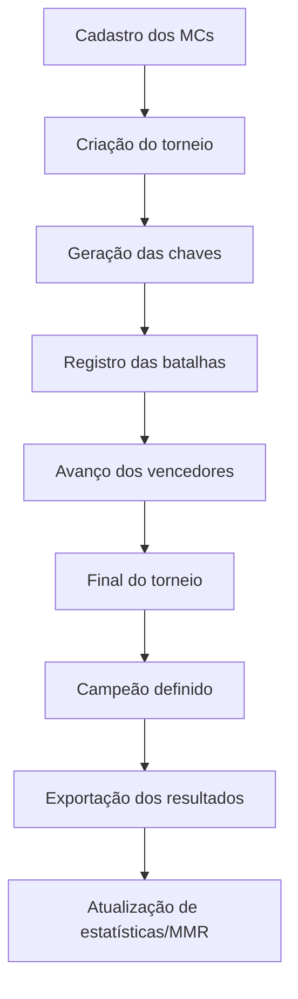

# BDA CARAI

<p align="center">
  
  
  
  
</p>

<p align="center">
  <strong>Aplicativo desktop para organizar batalhas de rap, gerar torneios, registrar resultados e acompanhar ranking/MMR dos MCs.</strong>
</p>

---

## 📌 Sobre o projeto

O **app** é um projeto pessoal criado para ajudar na organização de batalhas de rap locais.

A ideia é manter uma aplicação simples, prática e offline-first, onde seja possível cadastrar MCs, montar torneios, controlar batalhas, salvar resultados e evoluir um sistema de ranking baseado no desempenho dos participantes.

O projeto está sendo desenvolvido com foco em aprendizado, organização de eventos e construção gradual de uma ferramenta útil para a cena de batalhas.

---

## 🎯 Objetivo

O objetivo principal do app é facilitar o gerenciamento de torneios de rap, reduzindo o controle manual de chaves (com caneta e papel), vencedores e histórico de batalhas.

Com ele, o organizador pode:

- Criar torneios com participantes definidos.
- Gerar chaves de batalha automaticamente.
- Registrar vencedores por batalha.
- Avançar MCs nas fases do torneio.
- Definir campeão automaticamente ao final.
- Exportar resultados do torneio.
- Atualizar estatísticas e ranking dos MCs.
---

## 🧩 Funcionalidades atuais

| Área | Descrição |
|---|---|
| 🏆 Torneios | Criação e gerenciamento de torneios eliminatórios. |
| 👥 Participantes | Cadastro e seleção dos MCs participantes. |
| 🧱 Chaves | Geração automática das fases e batalhas. |
| ✅ Resultados | Registro dos vencedores de cada batalha. |
| 👑 Campeão | Identificação automática do campeão do torneio. |
| 📤 Exportação | Geração de arquivo com resumo e resultados do torneio. |
| 📊 Estatísticas | Base para atualização de vitórias, derrotas, torneios e MMR. |
| 🔑 Participant Key | Uso de uma chave única para identificar MCs de forma mais segura. |

---

## 🔑 Por que usar `participant_key`?

No começo, o projeto dependia bastante do `id` numérico dos participantes.

Isso funciona em muitos casos, mas pode gerar problemas quando os dados são exportados, importados, recriados ou comparados entre arquivos diferentes.

Por isso, o projeto passou a usar uma chave única, como:

```json
"participant_key": "mc_$hexhey"
```

Essa chave ajuda a identificar o MC de forma mais estável, mesmo que o `id` interno mude em algum momento.

Exemplo de campeão salvo no resultado:

```json
"champion": {
  "id": 94,
  "participant_key": "mc_b92c421d5a4c",
  "name": "MC A"
}
```

---

## 🧠 Como o fluxo funciona



---

## 🛠️ Tecnologias usadas

| Tecnologia | Uso no projeto |
|---|---|
| **Electron** | Criação da aplicação desktop. |
| **TypeScript** | Linguagem principal do projeto. |
| **SQLite** | Banco de dados local. |
| **Webpack** | Bundler usado pelo Electron Forge. |
| **Electron Forge** | Estrutura para desenvolvimento e build do app. |

---

## 📊 Ranking e MMR

O projeto também caminha para um sistema de ranking próprio, usando dados reais das batalhas.

A ideia é que cada MC tenha estatísticas como:

- Total de torneios jogados.
- Vitórias.
- Derrotas.
- Títulos.
- Participações em finais.
- MMR/rating.
- Histórico de confrontos.

O MMR pode ser usado para medir a evolução dos MCs ao longo dos eventos, criando um ranking idealista baseado em estátistica e números (coisa que não importa muito para batalhas de rap, pois, como já sabemos "computador não capta emoção espiritual, isso daqui é um ritual").

---

## 🧾 Exemplo de resultado exportado

```json
{
  "tournament": {
    "id": 1,
    "name": "Batalha da Praça"
  },
  "matches": [
    {
      "id": 90,
      "round": "final",
      "match_order": 1,
      "winner_id": 94,
      "win_type": "2x0",
      "participant1_id": 94,
      "participant1_key": "mc_b92c421d5a4c",
      "participant1_name": "MC44",
      "participant2_id": 89,
      "participant2_key": "mc_35f3c15ffb46",
      "participant2_name": "MC9"
    }
  ],
  "champion": {
    "id": 94,
    "participant_key": "mc_b92c421d5a4c",
    "name": "MC44"
  }
}
```

---

## 🚀 Como rodar o projeto

### 1. Instalar dependências

```bash
npm install
```

### 2. Rodar o app em modo desenvolvimento

```bash
npm start
```
---
## 🗺️ Próximos passos

- [ ] Melhorar a visualização das chaves em formato de árvore.
- [ ] Finalizar o cálculo de MMR.
- [ ] Criar tela de ranking dos MCs.
- [ ] Criar histórico individual por MC.
- [ ] Melhorar a exportação textual do torneio.
- [ ] Adicionar filtros por torneio, data e participante.
- [ ] Criar build instalável para Windows.
- [ ] Melhorar validações ao cadastrar participantes.
- [ ] Separar melhor regras de negócio, banco e interface.

---

## 📍 Contexto

O **app** nasceu da necessidade de organizar melhor batalhas de rap locais, registrando confrontos, campeões e evolução dos participantes.

Além de ser uma ferramenta para eventos, o projeto também serve como estudo prático de desenvolvimento desktop, banco de dados, regras de torneio e modelagem de ranking.

---
## 👤 Autor

Desenvolvido por **na-silva** + LLMs.
Projeto pessoal voltado para organização de batalhas de rap e aprendizado em desenvolvimento de software.
---

<p align="center">
  <strong>🎤 ISSO É BDA CARAI — organizando batalhas, resultados e ranking da cena local.</strong>
</p>
